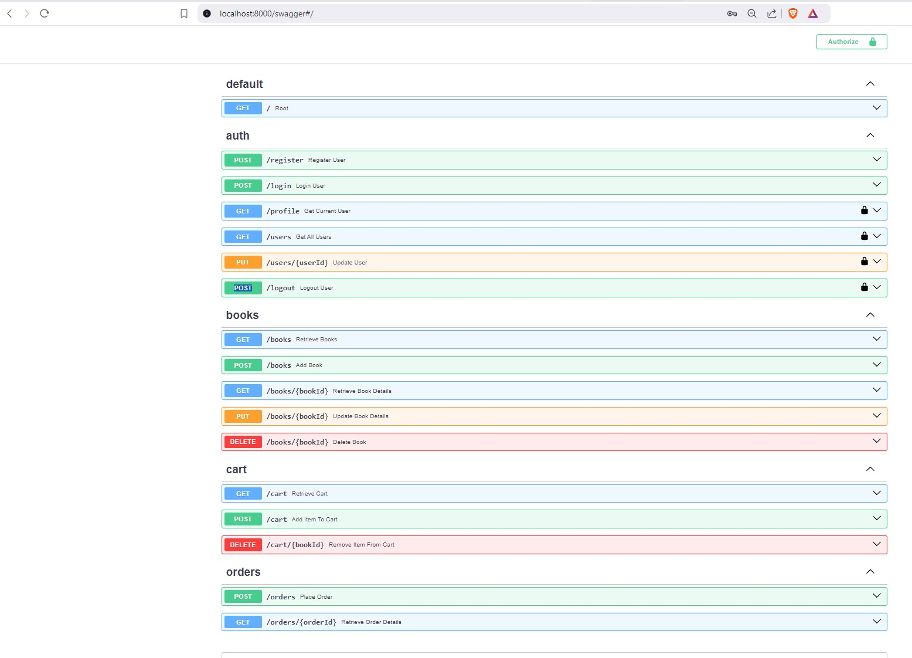

# Preconditions
1. Install Docker Desktop
2. Install PyCharm ( for development purpose )
3. git clone git@github.com:RalucaCraciun/Online-Bookstore.git

# Running the application
1. Open the cloned repository using pycharm
2. Open the Docker Desktop
   

3. In terminal in the root folder write ```docker-compose up --build```
   

4. Wait for everything to be up
   

5. Enter on ```http://localhost:8000```
   

6. Enter on ```http://localhost:8000/swagger```
   There will be available every endpoint.
   
